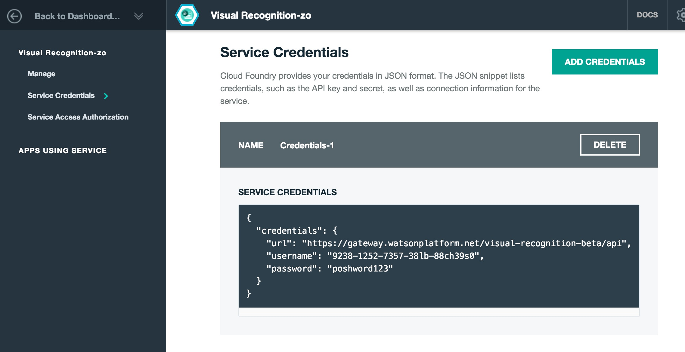

# Testing out IBM Watson's Visual Recognition API

__Points: 3__

__Due: March 1, 2016__

## Readings

- [Why Facebook is beating the FBI at facial recognition](http://www.theverge.com/2014/7/7/5878069/why-facebook-is-beating-the-fbi-at-facial-recognition)
- [Classifying tanks with the IBM Visual Recognition Service](http://cmadison.me/2015/12/03/classifying-tanks-with-the-ibm-visual-recognition-service/) - This article discusses how to create a custom classifier, which we will do in the next phase of this project.
- [Google Unveils Neural Network with “Superhuman” Ability to Determine the Location of Almost Any Image](https://www.technologyreview.com/s/600889/google-unveils-neural-network-with-superhuman-ability-to-determine-the-location-of-almost/)
- [Breaking Linear Classifiers on ImageNet](http://karpathy.github.io/2015/03/30/breaking-convnets/)
- [What makes Paris look like Paris?](http://graphics.cs.cmu.edu/projects/whatMakesParis/)

## Programming overview

This is a warmup for a project which we'll discuss next week, and one in which the processes are pretty much the same as the [show-me-project](https://github.com/compciv/show-me-earthquakes), except simpler:

- Collect data
- Send it to an API that purports to provide us data about our data 
- Analyze the API's response
- Filter and publish the response as HTML

For the final phase of the project, I expect everything to be as automated as possible, including the gathering of the data and its analysis. But rather than worry what the data should be, or an efficient way of mechanically gathering and classifying it, or what data should be gathered in the first place...let's just see if [IBM Watson's Visual Recognition Tool](https://www.ibm.com/smarterplanet/us/en/ibmwatson/developercloud/visual-recognition.html) does what it claims.

Manually find a few images to test out. Write the code to send the images to IBM and receive its response. Then print out a [basic HTML page](http://stash.compciv.org/samples/watson-preview/printout.html). When I say "basic", I mean [__basic__](http://stash.compciv.org/samples/watson-preview/printout.html).

## Programming requirements

In your `compciv-2016/homework` folder, make a new folder named `watson-preview`. When everything works, your repo structure should look similar to this:

    └── compciv-2016
       └── homework
           └── watson-preview
           ├── creds_watson_visual.json
           ├── fetcher.py
           ├── printout.py
           ├── recog.py
           ├── printout.html
           ├── pics
           │   ├── a.jpg
           │   ├── b.jpg
           │   ├── c.jpg
           │   ├── d.jpg
           │   ├── e.jpg
           │   └── f.jpg
           └── responses
                ├── a.jpg.json
                ├── b.jpg.json
                ├── c.jpg.json
                ├── d.jpg.json
                ├── e.jpg.json
                └── f.jpg.json

##### Signing up for an IBM Watson developer account

As in other projects, we need an API key from IBM to use its service. That key will be saved in your `homework/watson-preview` folder as:

     creds_watson_visual.json

Why JSON. Because that's the way IBM does it. 

Jump to the About [IBM Watson's Visual Recognition API section](#TK) for more information about signing up.

##### fetcher.py

This script should read from a list of at least 5 URLs that point to images online, preferably from sources in which copyright infringement is not an issue:

- [White House Flickr](https://www.flickr.com/photos/whitehouse/) 
- [Library of Congress Flickr](https://www.flickr.com/photos/8623220@N02/)
- [NYPL Digital Collections](http://digitalcollections.nypl.org/)
- [WikiCommons](https://commons.wikimedia.org/wiki/Main_Page)
- [Wikipedia's list of public domain image resources](https://en.wikipedia.org/wiki/Wikipedia:Public_domain_image_resources)

Each URL should be downloaded into a subfolder named `pics`.

##### recog.py

Create a `responses` subfolder.

For every file that exists in the `pics` subfolder, send the image file to IBM Watson's Visual Recognition API's [__classify__ endpoint](https://watson-api-explorer.mybluemix.net/apis/visual-recognition-v2-beta#!/visual-recognition/classifyService). 

IBM will send back a JSON response (check out examples in this repo's [responses/](responses) folder). Save each response into your `responses` folder.

While [you can read IBM the documentation here](https://watson-api-explorer.mybluemix.net/apis/visual-recognition-v2-beta#!/visual-recognition/classifyService) and try to figure it out for yourself, it's not as straightforward as just sending the filename as it exists on your computer to IBM's servers...because why would that filename have any relevance to IBM's servers, unless you mean to give them direct access to your hard drive to get that image by filename?

You obviously don't. So we use Python and the Requests library to serialize the bytes of a given image file before sending it. Also, this API requires the use of the __POST__ method, which must means we use `requests.post()` instead of `requests.get()`.

That said, I pretty much provide the exact code you need in this [sample recog.py](recog.py) script. The particularly relevant section, assuming that `fname` points to any given filename:

~~~py
with open(fname, 'rb') as imgdata:
   ## Talk to IBM
   ## need to send the imgdata in a dict type object
   mydict = {}
   mydict['images_file'] = (fname, imgdata)
   resp = requests.post(API_ENDPOINT, params=DEFAULT_PARAMS,
                   auth=myauth, headers=DEFAULT_HEADERS,
                   files=mydict)
~~~

You shouldn't have to change any part of this in the [sample recog.py script](recog.py), except to uncomment it out. If things work, the `resp` object will contain what we've seen it contain when doing normal `requests.get()` calls.

##### printout.py

By this point, your `pics` and `responses` folders should contain a list of files and Watson's API responses to those files, respectively.

This script will create a new file, named `printout.html`, and this file (which is a text file, like every other webpage), should contain:

- Some kind of headline, e.g. `"My name is dan"`
- For every image file:
  + Display the image via the `img` tag. This is done by linking to its path on your own hard drive, relative to your homework folder, i.e. `pics/myphoto.jpg`
  + Get the corresponding API response from your `responses` folder and parse the JSON
    * For each classifier score, print out:
      - The name of the classifier: `'Dancing'`
      - The score (e.g. `0.616775`)

An example [printout.html](http://stash.compciv.org/samples/watson-preview/printout.html) can be viewed here:

[http://stash.compciv.org/samples/watson-preview/printout.html](http://stash.compciv.org/samples/watson-preview/printout.html)

Its [source code](printout.html) is also included in this repo.

When you're done with this script, you should have `printout.html` on your own hard drive. And opening it should just open and render it as if it were any other webpage.

# About the IBM Watson Visual Recognition API

Via the [landing page](https://www.ibm.com/smarterplanet/us/en/ibmwatson/developercloud/visual-recognition.html):

> Visual Recognition allows users to understand the contents of an image or video frame, answering the question: “What is in this image?” Submit an image, and the service returns scores for relevant classifiers representing things such as objects, events and settings. What types of images are relevant to your business? How could you benefit from understanding and organizing those images based on their contents? With Visual Recognition, users can automatically identify subjects and objects contained within the image and organize and classify these images into logical categories. Need to train Visual Recognition on specific or custom content? Easily train a new classifier by sending examples and voila! Custom image recognition!

The documentation for the API itself can be found here, though [you don't need to read and study it to do this exercise](https://www.ibm.com/smarterplanet/us/en/ibmwatson/developercloud/visual-recognition/api/v2/#).

## Testing it out

This homework exercise is merely a way to partially automate the usage of IBM's service. As in previous exercises, we can always do things the old-fashioned way.

1. Get a URL for an image. Something like [this](https://farm2.staticflickr.com/1445/24129414022_f89da8ea52_b_d.jpg).
2. Go to the [Watson Visual Recognition Demo page](https://visual-recognition-demo.mybluemix.net/).
3. Paste your image URL and examine the JSON results.

The homework is basically just automating steps 2 through 3. In the next project, you will figure out a way to automate step 1.

## Create an IBM Watson and Bluemix account

So IBM has a developers service that you can sign up for. But you also need to sign up for their __Bluemix__ service, which is their cloud services platform...suffice to say, it may not be clear which is which. Try registering through here:

[https://console.ng.bluemix.net/registration/](https://console.ng.bluemix.net/registration/)

## Getting a credentials file

After you've signed up for an IBM Bluemix account, you need to specifically select which service you want credentials for. Visit this URL:

[https://console.ng.bluemix.net/catalog/services/visual-recognition](https://console.ng.bluemix.net/catalog/services/visual-recognition)

If you're not already logged in, do so now (using whatever you used to sign up for Bluemix). You should be asked to select a service to get credentials for. And you should end up at a screen that looks like this:

Copy that and make it your `creds_watson_visual.json`

# Watson compared to other services

Watson's results should seem wonky, if not downright inferior. We'll understand why (or why not) next week. But for now, it's useful to compare it to other services:

- Project Oxford Face detection https://www.projectoxford.ai/demo/face
- Project Oxford Feature Analysis https://www.projectoxford.ai/demo/vision#Analysis
- Faceplusplus Detect http://www.faceplusplus.com/demo-detect/
- Faceplusplus Search (to determine which famous person it is) http://www.faceplusplus.com/demo-search/
